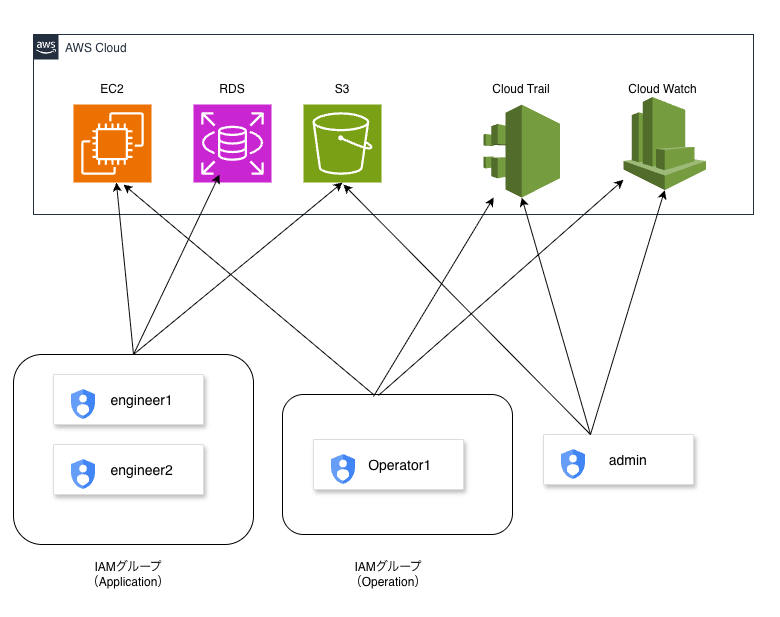
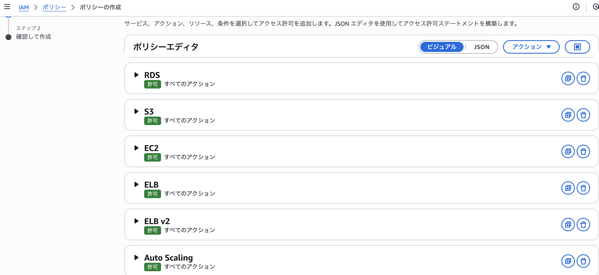
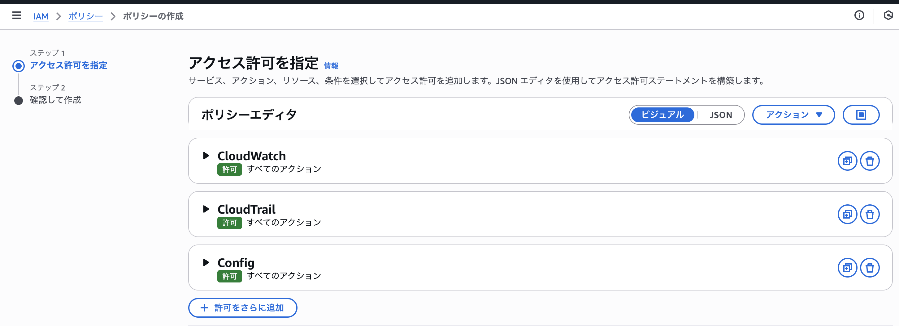
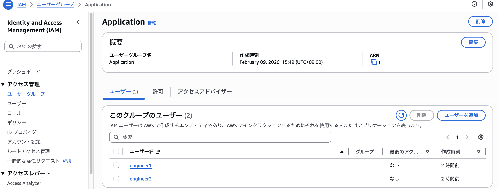
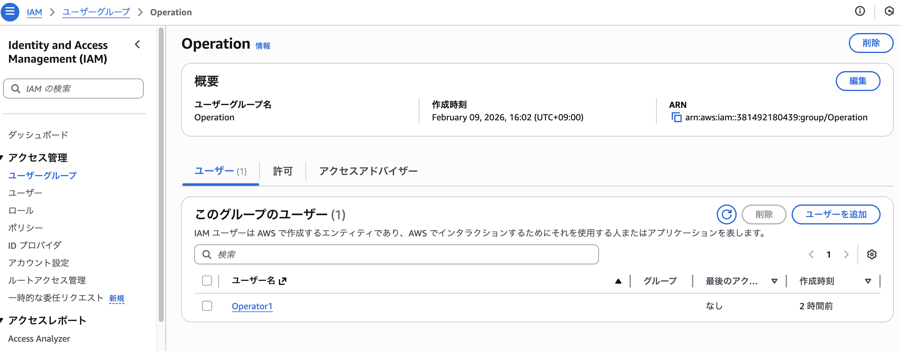
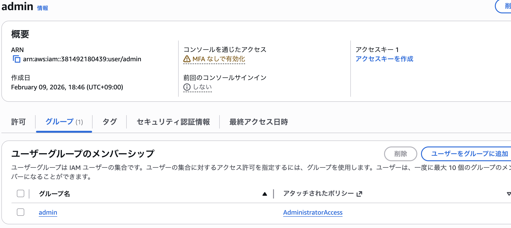
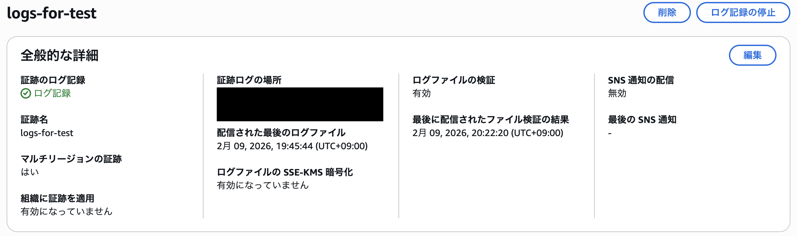
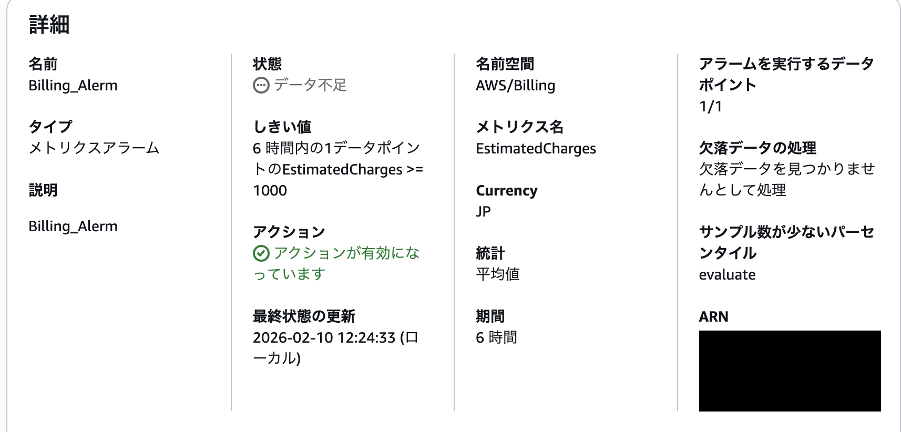
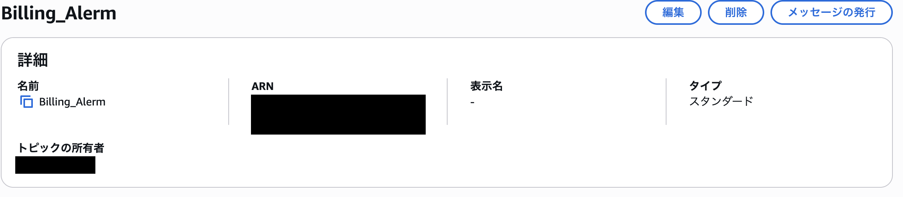
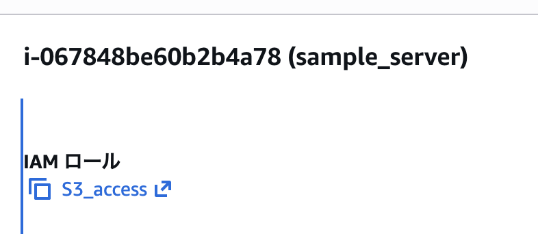

# IAMユーザ・グループ作成メモ

## 目的
- IAMユーザの作成方法及び意義
- IAMユーザの運用方法
- 適切なコスト管理

## 設計方針
- 最小権限の原則に基づき、役割ごとに権限を分離

## 構成図


---

## 構成

- IAMユーザ構成

| ユーザ名 | 役割 | 権限 |
|----|----|----|
| admin                 | 管理者  　　 | Admin権限を付与  　　　　　　　　　　　　|
| Operator1             | 運用管理者   | 運用ツールや開発環境のアクセスを付与  　　|
| engineer1, engineer2  | 開発者  　　 | アプリ開発環境のみアクセスを付与  　　　　|

<br>

- IAMグループ構成

| グループ名 | 所属メンバー |
|----|----|
| Operation   | Operator1 |
| Application | engineer1, engineer2 |

<br>

- ポリシー構成

| ポリシー名 | 権限 |
|----|----|
| AdministratorAccess | フルアクセス |
| Operation           | EC2、ELB、Autoscaling、RDS、S3、ClooudWatch、CloudTrail、Config フルアクセス権限|
| Application         | EC2、ELB、Autoscaling、RDS、S3 フルアクセス権限|
| S3_acccess          |  EC2からS3へのアクセス権限（ロール） |

<br>

- CloudTrail設定

| 証跡名 | 保存先 | イベント |
|----|----|----|
|  logs-for-test | S3 |　管理イベント　|

AWS環境の操作ログを取得し、監査およびセキュリティ対策を行うため有効化

<br>

- CloudWatch請求アラーム設定

| 請求名 | SNSトピック |　内容 |
|----|----|----|
| Billing_Alarm | Billing_Alarm |　コストアラーム通知　|

<br>

---

## 構築手順

### 1. IAMポリシーの作成

1. Application（カスタムポリシー）の作成<br>


2. Oeration（カスタムポリシー）の作成<br>


<br>

### 2. IAMグループ・ユーザの作成

1. Applicationグループを作成し、engineer1, engineer2を追加<br>

   
2. Operationグループを作成し、Operator1を追加<br>


3. adminグループを作成し、adminユーザを追加<br>

   
<br>

### 3. CloudTrailのログ有効化

- 管理イベントのみ取得
- ログ保存先: S3


<br>

### 4. CloudWatchアラームの有効化

- コスト通知（1000円以上）
- 送信方法: SNS
- サブスクリプションの有効化



<br>

### 5. IAMロールの割り当て

- ロール割り当て用のEC2（sample_server）の作成
- ロールポリシー（S3_access）の作成
- ロールのアタッチ


**実行コマンド**

```bash

aws s3 ls
```
**実行結果**

```bash
# S3バケット一覧が表示されていることを確認

2026-02-09 10:15:34 aws-cloudtrail-logs-XXXXXXXX
```


---

## 学んだこと
- IAMユーザへ直接権限付与するのではなく、グループ経由で付与するのが推奨
- CloudTrailを有効化することで監査ログを取得できる
- CloudTrailおよびBillingアラームを有効化することで、セキュリティおよびコスト監視を実装できる
- 信頼ポリシーがリソースの信頼を、許可ポリシーで実際にどのような操作を許可するかを定義する

---

## 詰まった点・要確認事項
1. IAMポリシー（JSON形式）の記述方法や何を意味するのかを確認する、主に以下。
  - Statement　ポリシーを記載することを宣言、複数可
  - Principal  適用するアカウント・ユーザ。ロールを指定
  - Action     特定のリソースに対する許可・否定の宣言
  - Resource   Actionで設定したリソース一覧
  - Condition  ポリシーの対象を絞る設定。（IPアドレスの制限など）

--

## 参考
