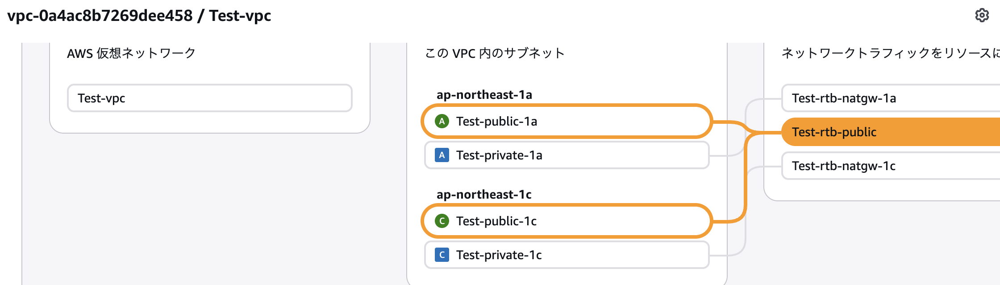
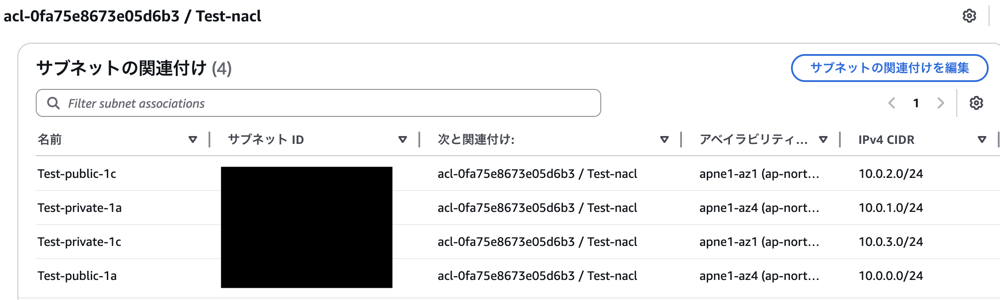
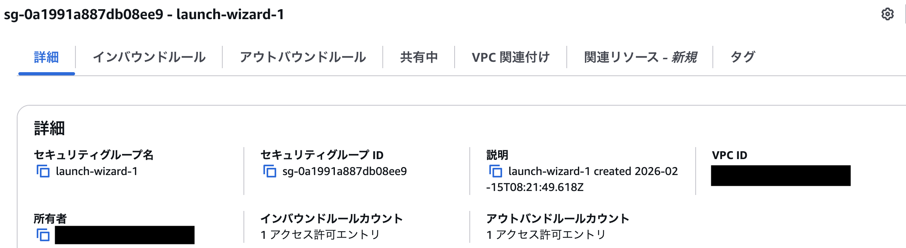
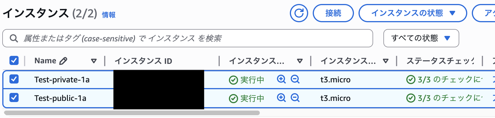
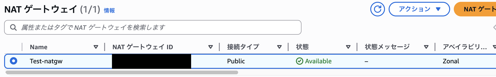
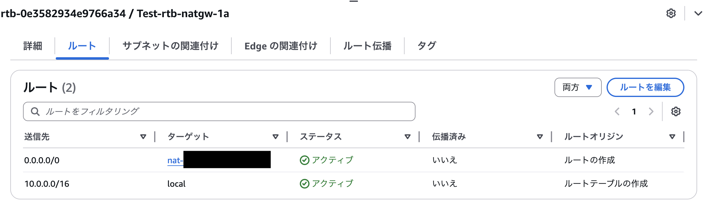

# VPC作成メモ

## 目的
- VPC及びサブネットの作成方法
- ネットワークの構築
- プライベートサブネットからの外部通信方法

## 設計方針
- Public / Private Subnet を分離しセキュリティを確保
- Private Subnet は NAT Gateway 経由でのみインターネット通信
- 

## 構成図


---

## 構成

- インターネットゲートウェイ構成

| IGW名 | 接続先VPC | 関連 | ルーティング |
|----|----|----|----|
| Test-igw | Test-vpc | Test-rtb-public | 0.0.0.0/0 → IGW | 

<br>

- NATゲートウェイ構成

| NAT Gateway名 | 配置サブネット | AZ | Elastic IP | 用途 |
|------|------|------|------|------|
| Test-natgw | Test-public-1c | ap-northeast-1c | Test-eip-1c | Test-private-1cのアウトバウンド通信 |

<br>

-  VPC構成

| VPC名 | CIDR |
|----|----|
| Test-vpc | 10.0.0.0/16 |

<br>

- サブネット構成

| AZ | サブネット名 | 種別 | CIDR |
|----|----|----|----|
| ap-northeast-1a | Test-public-1a  | Public | 10.0.0.0/24 |
| ap-northeast-1a | Test-private-1a | Private | 10.0.1.0/24 |
| ap-northeast-1c | Test-public-1c  | Public | 10.0.2.0/24 |
| ap-northeast-1c | Test-private-1c | Private | 10.0.3.0/24 |

<br>

- ルートテーブル構成

| AZ | ルートテーブル名 | 関連サブネット | 宛先 | ターゲット |
|----|----|----|----|----|
| 1a | Test-rtb-public     | Test-public-1a  | 0.0.0.0/0 | IGW |
| 1a | Test-rtb-natgw-1a   | Test-private-1a | 0.0.0.0/0 | NATGW-1a |
| 1c | Test-rtb-public     | Test-public-1c  | 0.0.0.0/0 | IGW |
| 1c | Test-rtb-natgw-1c   | Test-private-1c | 0.0.0.0/0 | NATGW-1c |

<br>

- セキュリティグループの構成

| Direction | Protocol | Port | Source/Destination | 用途 |
|------------|----------|------|--------------------|------|
| Inbound    | TCP      | 22   | 0.0.0.0/0          | SSH接続 　　　|
| Outbound   | All      | All  | 0.0.0.0/0          | 外向き通信許可 |

<br>

- ネットワークACL（Test-nacl）の構成

| ルール番号 | Direction | Protocol | Port | Source/Destination | Allow/Deny |
|------------|------------|----------|------|--------------------|------------|
| 100        | Inbound    | SSH   | 22  | 0.0.0.0/0 | Allow |
| 200        | Inbound    | HTTP  | 80  | 0.0.0.0/0 | Allow |
| 300        | Inbound    | HTTPS | 443 | 0.0.0.0/0 | Allow |
| 400        | Inbound    | カスタムTCP | 1024 - 65535 | 0.0.0.0/0 | Allow |
| *          | Inbound    | All   | All | All       | Deny |
| 100        | Outbound   | SSH   | 22  | 0.0.0.0/0 | Allow |
| 200        | Outbound   | HTTP  | 80  | 0.0.0.0/0 | Allow |
| 300        | Outbound   | HTTPS | 443 | 0.0.0.0/0 | Allow |
| 400        | Outbound   | カスタムTCP | 1024 - 65535 | 0.0.0.0/0 | Allow |
| *          | Outbound   | All   | All | All       | Deny |

<br>

- EC2構成

| AZ | インスタンス名 | 関連サブネット |
|----|----|----|
| 1a | Test-public−1a     | Test-public-1a  |
| 1a | Test-private-1a    | Test-private-1a |

---

## 構築手順

### 1. VPCの作成
- IGWの作成
- パブリック・プライベートサブネットの作成
- ルートテーブルの紐付け



<br>

### 2. セキュリティグループ・ネットワークACLの設定
- ネットワークACLの作成しVPCにアタッチ


- セキュリティグループを作成


<br>

### 3. EC2インスタンスの作成
- AZ（1a）にパブリック・プライベートインスタンスの作成


- パブリック → プライベートに接続

**実行コマンド**

```bash
# パブリックインスタンスに接続
ssh -i ~/.ssh/test_sample.pem ec2-user@[パブリックIP]

# rootにスイッチ
sudo su

# プライベートインスタンスの接続（private_keyにキーペアをコピーすること）
ssh ec2-user@[プライベートIP] -i private_key.pem

```

<br>

### 4. NATゲートウェイの作成
- NAT（Test-natgw）ゲートウェイをパブリックサブネット（Test-public-1a）に作成


- ルートテーブル（Test-rtb-natgw-1a）の編集


- プライベートサブネットから外部通信可能か検証

<br>

**実行コマンド**

```bash
# 外部通信のためGoogleへ疎通確認
curl -I https://www.google.com
```

**結果**

```bash
# 下記のようにステータス200が返ってくる
HTTP/2 200
```

---

## 学んだこと

- NATGWの接続タイプは基本パブリックを指定するが、プライベートは他のVPCやオンプレ環境と通信する際に使われる

---

## 詰まった点・要確認事項

--

## 参考

- https://cx.genech.co.jp/column/20250612-2
- https://qiita.com/melonattacker/items/145dd8763883cb922400
