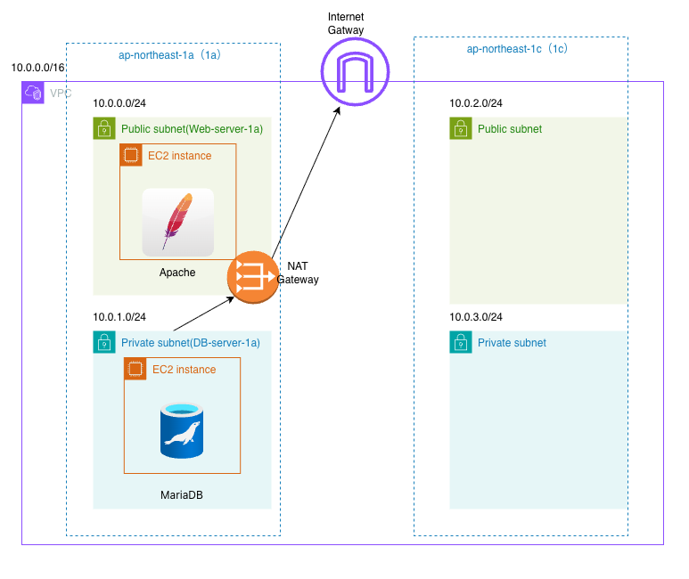
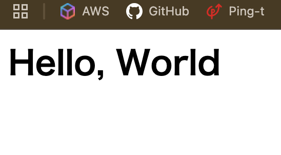
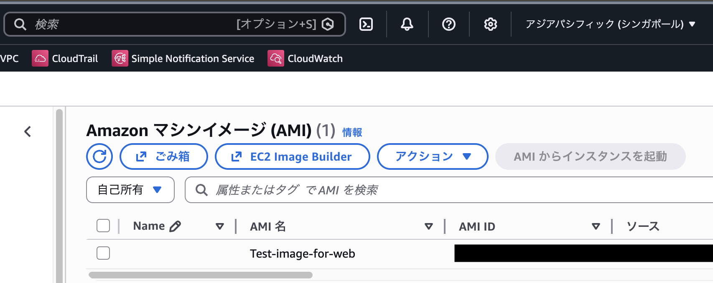
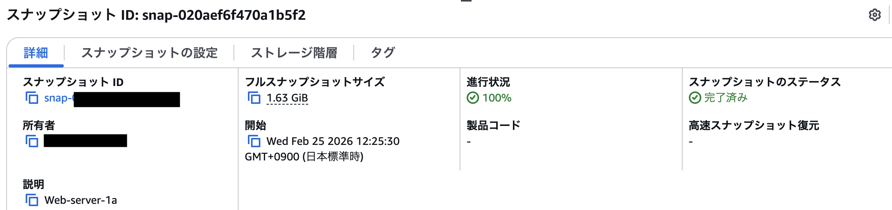
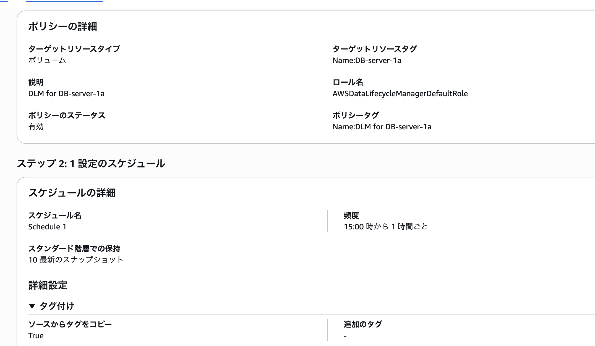

# EC2設計・構築メモ

## 目的

- Web、DBサーバの構築方法
- EC2インスタンスのバックアップの仕方

## 設計方針

- WebサーバはPublic Subnetに配置し外部公開を実施
- DBサーバはPrivate Subnetに配置し直接インターネットへ公開しない設計
- DBサーバの外部通信はNAT Gateway経由とする
- 将来的なAutoScalingを見据え、Web層とDB層を分離
- AMIをリージョン間コピーすることで、災害対策（DR）を想定。

## 構成図


---

## 構成

- EC2構成

| インスタンス名 | 配置サブネット | AZ |　用途 |
|------|------|------|------|
| Web-server-1a | Test-public-1a | ap-northeast-1a | Apacheサーバ |
| DB-server-1a | Test-private-1a | ap-northeast-1a  | DBサーバ |

<br>

- セキュリティグループ構成

| Direction | Protocol | Port | Source/Destination | 用途 |
|------------|----------|------|--------------------|------|
| Inbound    | TCP      | 22   | 0.0.0.0/0          | SSH接続 |
| Inbound    | HTTP     | 80   | 0.0.0.0/0          | Web通信 |
| Inbound    | HTTPS    | 443  | 0.0.0.0/0          | Web通信 |
| Outbound   | All      | All  | 0.0.0.0/0          | 外向き通信許可 |

<br>

- その他構成は下記のセクションで使用したリソースを引用（構成を参照）

[02_VPC/docs/vpc.md](https://github.com/ttakumi0027-beep/aws-practice-lab/blob/main/02_VPC/docs/vpc.md)

---

## 構築手順

### 1. Webサーバの作成

- インスタンス（Web-server-1a）の作成
- Apacheのインストール

**実行コマンド**

```bash
# Apacheのインストール
yum install httpd -y

# httpdを自動起動に設定
systemctl enable httpd

```

- index.htmlファイルの作成

<details>
<summary>index.htmlの中身</summary>
  
```/var/www/html/index.html
<html>
<h1>Hello, World</h1>
</html>
```

</details>

- Webブラウザより表示されていることを確認

<br>

### 2. DBサーバの作成

- EC2インスタンス（DB-server-1a）の作成
- NATGWの作成
- ルートテーブルにNATGW用のルートを設定
- MariaDBのインストール
<details>
<summary>MariaDBインストール手順</summary>
  
```bash
# MariaDBのインストール
sudo dnf install mariadb105-server -y

sudo systemctl start mariadb

sudo systemctl enable mariadb

# ルートPWの設定
mysql_secure_installation

# SQL接続
mysql -u root -p

# test_dbテーブルの作成
CREATE DATABASE test_db;

# テーブルの確認
SHOW DATABASES;
```

</details>

<br>

### 3. AMIによるバックアップ

- WebサーバのAMI（Test-image-for-web）を手動で取得
- AMIからの起動及び接続確認

**実行コマンド**

```bash
# httpdがインストールされているか確認
yum list installed | grep httpd
```
**結果**

```bash
generic-logos-httpd.noarch             18.0.0-12.amzn2023.0.3             @amazonlinux
httpd.x86_64                           2.4.66-1.amzn2023.0.1              @amazonlinux
httpd-core.x86_64                      2.4.66-1.amzn2023.0.1              @amazonlinux
httpd-filesystem.noarch                2.4.66-1.amzn2023.0.1              @amazonlinux
httpd-tools.x86_64                     2.4.66-1.amzn2023.0.1              @amazonlinux
```
→ ブラウザより”Hello, World”が表示されていることも確認


- シンガポールリージョンのAMIをコピー →　同じく起動およびブラウザの表示を確認


### 4. スナップショットの作成

- ボリュームのスナップショットの作成
- インスタンス（Web-server-1a）を停止、ボリュームのデタッチ
- スナップショットより、ボリュームのアタッチ
- インスタンス起動し、ボリュームがアタッチしていることを確認


### 5. DLMの設定

- インスタンス（DB-server-1a）を下記のようにスクジュールを設定



---

## 学んだこと

- EIPの関連付け固定IPを設定できる　→ インスタンスを停止しても、同じIPアドレスを使用できる
- 起動テンプレートを利用することで、あらかじめ設定したテンプレからインスタンスを起動できる
- AMIを別のリージョンにコピーでき、バックアップが可能（EBSボリュームのスナップショットも含む）
- EBSのボリュームは増やすことはできるが、減らすことはできない
- スナップショットはAWSが管理しているS3に保存される（自分が作成したS3ではない）

---

## 詰まった点・要確認事項

- SQL構文の確認
- MySQLを利用する予定だったが、Amazon Linux 2023は OpenSSL 3 系なのでOracle公式RPMはそのままでは依存関係エラーになったため、Maria DBを利用。→ Dockerなどを利用すればMySQLを使える。

--

## 参考

- https://qiita.com/y-keiyu/items/7c240a65ea708f6f8e96
- https://www.digitalocean.com/community/tutorials/how-to-install-mariadb-on-ubuntu-20-04-ja

---
