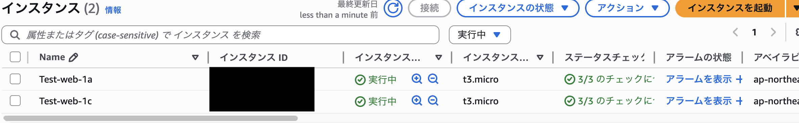
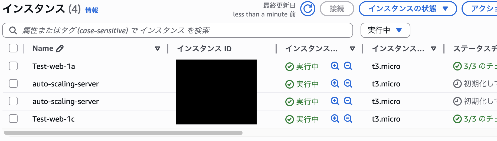

# ELB設計・構築メモ


## 目的

- ALBによる負荷分散の挙動確認
- ASGによるオートスケーリング作成
- RDSのレプリカ構築

---

## 設計方針

- 単一AZ障害時にもWebサービスを継続させるためマルチAZ構成
- ALBによる高可用性
- パブリックとプライベートサブネットによるネットワークの分離
-

---

## 構成図


---

## 構成

- インターネットゲートウェイ構成

| IGW名 | 接続先VPC | 関連 |
|----|----|----|
| Test-igw | Test-vpc | Test-rtb-public |


- NATゲートウェイ構成

| NAT Gateway名 | 配置サブネット | AZ | 用途 |
|------|------|------|------|
| Test-natgw | Test-public-1a | ap-northeast-1a | Test-private-1aのアウトバウンド通信 |


-  VPC構成

| VPC名 | CIDR |
|----|----|
| Test-vpc | 10.0.0.0/16 |


- サブネット構成

| AZ | サブネット名 | 種別 | CIDR |
|----|----|----|----|
| ap-northeast-1a | Test-public-1a  | Public | 10.0.0.0/24 |
| ap-northeast-1a | Test-private-1a | Private | 10.0.1.0/24 |
| ap-northeast-1c | Test-public-1c  | Public | 10.0.2.0/24 |
| ap-northeast-1c | Test-private-1c | Private | 10.0.3.0/24 |


- EC2構成

| AZ | インスタンス名 | 関連サブネット |
|----|----|----|
| 1a | Test-web-1a | Test-public-1a  |
| 1c | Test-web-1c | Test-public-1c  |


- ASG構成

| ASG名 | 起動テンプレ名 | 希望/最小/最大 | AZ |
|----|----|----| ---- |
| Test-asg | Test-for-asg | 2/2/4 | 1a/1c |

- SG構成

| Direction | Protocol | Port | Source/Destination | 用途 |
|------------|----------|------|--------------------|------|
| Inbound    | TCP      | 22   | 0.0.0.0/0          | SSH接続      |
| Inbound    | TCP      | 80   | 0.0.0.0/0          | HTTP通信 　　|
| Inbound    | TCP      | 80   | web-server-sg      | ALBからのHTTP通信 |
| Outbound   | All      | All  | 0.0.0.0/0          | 外向き通信許可 |

---

## 構築手順

### 1. VPC/サブネットの作成

- VPC/サブネット/IGW/NATの作成
- S3バケット（test-vpc-20260302）の作成


### 2. EC2の作成

- Webサーバ（Test-web-1a）の作成　→ 起動時に下記のシェルの実行

<details>
<summary>シェル</summary>

```bash
#!/bin/bash

# サーバーの設定変更
hostnamectl set-hostname Test-bash
timedatectl set-timezone Asia/Tokyo
localectl set-locale LANG=ja_JP.UTF-8

# Apacheのインストール
sudo yum update -y
sudo yum install httpd -y
sudo systemctl start httpd
sudo chkconfig httpd on

# index.htmlの設置
aws s3 cp s3://test-vpc-20260302/index.html /var/www/html

```

</details>

<details>
<summary>シェルの確認</summary>

```bash
# httpdがインストールされていること
yum list installed | grep httpd

# httpdが起動していること
systemctl status httpd

# ホスト名が、Test-bashであること
cat /etc/hostname 

# Asia/Tokyoが表示されていること
ls -la /etc/localtime 

# LANG=ja_JP.UTF-8が表示されていること
cat /etc/locale.conf 

# index.htmlが確認できること
ls -la /var/www/html/index.html
```

</details>

- AMI（test-vpc-web-server）の作成
- Webサーバ（Test-web-1c）をAMIより作成


### 3. ターゲットグループの作成

- ターゲットグループ（Test-elb-tg）に、Webサーバを追加
- ロードバランサー（Test-alb）の作成
- ロードバランサーのDNS名より、ブラウザに下記のようにindex.htmlの中身が表示されること


### 4. ASGの作成

- 起動テンプレート（Test-for-asg）の作成
- ASGの作成
- Auto Scaling用のインスタンスが立ち上がっているか確認


- インスタンス（Test-web-1aとTest-web-1c）をASGにアタッチ
- 稼働しているインスタンスが２台であること


- stressのインストール

```bash

# stressのインストール
wget https://rpmfind.net/linux/dag/redhat/el7/en/x86_64/dag/RPMS/stress-1.0.2-1.el7.rf.x86_64.rpm

sudo rpm -ivh stress-1.0.2-1.el7.rf.x86_64.rpm

rpm -qa|grep stress

# バージョンが表示される
stress --version

#stressによるCPU負荷コマンド
stress -c 2 -t 300

```
- それぞれのサーバにログインし、stressをかける
- 下記のようにスケールする


- 負荷停止後に、サーバが２台にスケールインしていることを確認

### 5. RDSの作成

- サブネットグループ（test-rds）の作成
- 


---

## 学んだこと

- ライフサイクルフックとは、ASGによるインスタンスの起動や削除といったときに、インスタンスを一時的に停止してカスタムアクションを実行
- RDSのスケーリングタイプには垂直、水平スケーリングがある。垂直はメモリやCPUの増強といったスケールアップを行い、水平はサーバの台数を増台することを意味する
- RDSのストレージは、後から増やすことはできるが減らすことはできない
- 

---

## 詰まった点・要確認事項

### 1. stressによる負荷がかからない件

・下記のコマンドでは負荷がかからなかったため修正。またWeb1台では、CloudWatchより平均43%ほどしか負荷がかからなかったため、Web2台で負荷をかけるようにした。

```bash
# 修正前
stress -c 1 -q &

# 修正後
stress -c 2 -t 300
```
--

## 参考


---
